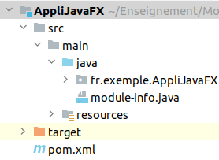
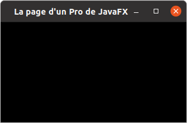

#  
# Développement d’applications avec IHM 

### IUT Montpellier-Sète – Département Informatique

* **Enseignants:**
  * [Sophie Nabitz](mailto:sophie.nabitz@univ-avignon.fr),
    [Cyrille Nadal](mailto:cyrille.nadal@umontpellier.fr),
    [Nathalie Palleja](mailto:nathalie.palleja@umontpellier.fr),
    [Xavier Palleja](mailto:xavier.palleja@umontpellier.fr),
    [Petru Valicov](mailto:petru.valicov@umontpellier.fr)
  * [Nihal Ouherrou](mailto:nihal.ouherrou@umontpellier.fr) -- responsable de la partie _Ergonomie_ du cours,
* [Email](mailto:sophie.nabitz@univ-avignon.fr) pour une question d'ordre privée concernant le cours.
* Le forum Piazza (LIEN À AJOUTER) de ce cours pour poser vos questions


Comme pour les TPs du cours _Développement Orienté Objets_, vous devrez ici aussi travailler dans un groupe [GitLab associé au cours d'IHM](https://gitlabinfo.iutmontp.univ-montp2.fr/ihm/). Dans ce groupe, vous aurez l'ensemble des forks des TPs et du projet qui apparaîtront au fur et à mesure.

Nous vous conseillons fortement de travailler avec IntelliJ IDEA. Vous pouvez aussi utiliser un autre IDE, mais dans ce cas, ce sera à vous de vous adapter.

Également, comme pour le cours _Développement Orienté Objets_, vous allez utiliser [Maven](https://fr.wikipedia.org/wiki/Apache_Maven) comme système de build pour vos projets JavaFX. Voici la structure d'un projet JavaFX construit avec Maven :



Ainsi le répertoire **src/main/java** contiendra :
* L'ensemble des paquetages de votre application ; dans l'exemple de l'image ci-dessus il n'y en a qu'un -- `fr.exemple.AppliJavaFX`.
* Un fichier spécial `module-info.java` qui décrit l'ensemble des paquetages externes utilisés dans votre application. En l'occurrence, les paquetages de la librairie JavaFX (on vous rappelle que JavaFX ne fait partie de l'API native Java). Les modules constituent une fonctionnalité importante de Java depuis la version 9 de la plateforme. Ils permettent de construire des exécutables (_.jar_) légers en encapsulant l'ensemble de dépendances nécessaires au bon fonctionnement de l'exécutable. En quelque sorte on peut les voir comme une abstraction de la notion de paquetage. Pour plus de détails :
    * http://tutoriels.meddeb.net/modules-java-concepts/
    * https://en.wikipedia.org/wiki/Java_Platform_Module_System
    * https://en.wikipedia.org/wiki/Modular_programming
    * https://www.oracle.com/fr/corporate/features/understanding-java-9-modules.html
      Le répertoire **src/main/test** contiendra l'intégralité des tests de votre application

Le répertoire **src/resources** contiendra l'ensemble de ressources du projet : feuilles de styles CSS, images, les fichiers `.fxml` contenant la description déclarative de vos interfaces graphiques etc.


Tout au long du TP, vous pouvez avoir besoin de **consulter les pages de documentation** de JavaFX, qui sont [disponibles ici](https://openjfx.io/javadoc/17/). Dans ce cours, nous allons travailler sur la version 17 de JavaFX. Si vous travaillez sur votre machine personnelle, pensez à installer la bonne version. Notez que JavaFX ne fait pas partie de l'API Java officielle, son développement actif ayant été externalisé depuis plusieurs années.

## TP 1 : Premiers pas avec JavaFX

Rappelez-vous que JavaFX est un framework Java pour le développement des interfaces graphiques (GUI) en Java. Une GUI JavaFX est construite grâce à un graphe de scène, où les nœuds correspondent à un ensemble d'éléments graphiques organisés de manière hiérarchique. La scène (un objet de type [`Scene`](https://javadoc.io/static/org.openjfx/javafx-fxml/17-ea+5/javafx.graphics/javafx/scene/Scene.html)) est associée à une fenêtre qui correspond à un objet de type [`Stage`](https://openjfx.io/javadoc/17/javafx.graphics/javafx/stage/Stage.html).

En principe, une application peut avoir plusieurs fenêtres, mais une est obligatoire -- la fenêtre principale (_primary stage_ en anglais). Celle-ci est fournie automatiquement par l'environnement d'exécution JavaFX. Ainsi l'exécution du code suivant lance une fenêtre vide et cachée (non visible à l'utilisateur) : 

```java
import javafx.application.Application;
import javafx.stage.Stage;

public class MaPremiereClasseJavaFX extends Application {

    @Override
    public void start(Stage primaryStage) throws Exception {
        // le code pour enrichir votre fenêtre
    }
}
```

Notez que la méthode `main(String args[]` n'est pas nécessaire ici, car le point d'entrée d'une application JavaFX est la méthode `start(Stage primaryStage)`. En revanche, vous pouvez toujours ajouter une méthode `main(String args[]` car souvent, c'est plus pratique (par exemple, ajouter des paramètres à la ligne de commande).

```java
import javafx.application.Application;
import javafx.stage.Stage;

public class MaPremiereClasseJavaFX extends Application {

  public static void main(String[] args) {
    // ici on peut passer des arguments à l'application JavaFX
    Application.launch(args);
  }
  
  @Override
  public void start(Stage primaryStage) throws Exception {
    // le code pour enrichir votre fenêtre
    primaryStage.setTitle("La page d'un Pro de JavaFX !"); // titre de la fenêtre
    primaryStage.show(); // rendre la fenêtre visible
  }
}
```
Dans le code ci-dessus la méthode statique `launch(String[] args)` va déclencher la méthode `start(Stage primaryStage)`. Notez que JavaFX est conçu de façon à ce que la méthode `launch(String[] args)` détecte correctement la méthode `start(Stage primaryStage)` à exécuter en fonction de la classe `Application` où `launch(String[] args)` a été lancée (dans l'exemple ci-dessus cette classe est `MaPremiereClasseJavaFX`).
Sur Linux, la fenêtre suivante s'affiche :



Si vous êtes sur un autre système d'exploitation (Windows, Mac OS, etc.) le design de la fenêtre sera différent, l'environnement JavaFX faisant le travail nécessaire d'adaptation. Dans tous les cas, cette fenêtre contiendra une bare de titre et un emplacement pour afficher la scène.

Dans les exercices qui vont suivre vous aller personnaliser votre fenêtre JavaFX avec différents éléments graphiques en construisant le graphe de scène.

### Exercice 1 - Contrôles de base

Pour commencer simplement, nous allons construire une petite application graphique qui correspond au *"Bonjour à tous"* traditionnel... <br/>
A la fin de chaque question, vous ferez exécuter votre nouvelle version de l'application. Pensez aussi à committer (et pousser) régulièrement.

1. Lisez le contenu de la classe `MaPremierFenetreJavaFX` du paquetage `fr.umontpellier.iut.exercice1` et faites exécuter la méthoe `main(String args[])`. Modifiez le titre de la fenêtre en *"Hello Application"* et fixez les largeur et hauteur à 400 (`setWidth` et `setHeight`).

2. Dans la méthode `start(Stage primaryStage)`, instanciez un conteneur [`VBox`](https://openjfx.io/javadoc/17/javafx.graphics/javafx/scene/layout/VBox.html), et précisez que les éléments qu'il contiendra seront centrés (en utilisant sa méthode `setAlignment(Pos p)`). Vous y ajouterez un [`Label`](https://openjfx.io/javadoc/17/javafx.controls/javafx/scene/control/Label.html) dont le texte actuel est *"Bonjour à tous !"*.
Déclarez ensuite une [scène](https://javadoc.io/static/org.openjfx/javafx-fxml/17-ea+5/javafx.graphics/javafx/scene/Scene.html) dans laquelle vous placerez votre conteneur et ajoutez cette scène à votre fenêtre principale (objet de la classe `Stage`).

3. Ajoutez maintenant un [`TextField`](https://javadoc.io/static/org.openjfx/javafx-fxml/17-ea+5/javafx.controls/javafx/scene/control/TextField.html) qui permettra de saisir un nom et fixez-en la largeur maximale (`setMaxWidth`) à 150. Puis ajoutez un [`Button`](https://javadoc.io/static/org.openjfx/javafx-fxml/17-ea+5/javafx.controls/javafx/scene/control/Button.html) construit avec le texte *"Dire bonjour"*.

   1. Vous allez maintenant ajouter un [gestionnaire d'événement](https://openjfx.io/javadoc/17/javafx.base/javafx/event/EventHandler.html) sur ce bouton afin d'intercepter l'action de clic sur ce bouton et lui associer une action de réponse spécifique. Dans un premier temps, vous l'ajouterez sous la forme d'une expression lambda (```actionEvent -> { ... }```). Une action sur ce bouton aura pour effet de transformer le texte du `Label` en *"Bonjour à toi, César"*, quand le texte *César* a été saisi dans le `TextField`.

   2. Transformez ensuite l'expression lambda en un attribut `final` de la classe, de type `EventHandler<ActionEvent>`. Vous serez amener à déplacer vos composants, qui deviennent maintenant des attributs de la classe.
   
   3. Faites en sorte qu'en tapant la touche _Entrée_ du clavier lors de la saisie du `TextField`, la même action que le clic du bouton, se déclenche.

4. Vous allez maintenant faire un peu de mise en forme... <br/>
Remplacez le texte du bouton par une image : pour cela, déclarez un objet de la classe [`ImageView`](https://javadoc.io/static/org.openjfx/javafx-fxml/17-ea+5/javafx.graphics/javafx/scene/image/ImageView.html) construit avec cette
 [URL](https://gitlabinfo.iutmontp.univ-montp2.fr/ihm/TP1/ressources/logo.jpeg) et utilisez la méthode `setGraphic(Node n)` sur le bouton. Notez que cette méthode reçoit un objet de type `Node` de JavaFX en paramètre et [`ImageView`](https://javadoc.io/static/org.openjfx/javafx-fxml/17-ea+5/javafx.graphics/javafx/scene/image/ImageView.html) est une de ses nombreuses sous-classes.<br/>
Changez la fonte du `TextField` en Courier 15 (`Font.font("Courier", FontWeight.NORMAL, 15)`) et celle du `Label` en 30 et bold.<br/>
Essayez aussi de changer l'image du bouton en utilisant la ressource *"Bonjour.jpg"* qui vous est fournie dans le répertoire _src/main/resources/exercice1/_.<br/>
Enfin, utilisez le fichier *"Bonjour.css"* pour configurer la scène, en utilisant <ul> `scene.getStylesheets().add(getClass().getClassLoader().getResource("exercice1/Bonjour.css").toExternalForm());`.</ul>

### Exercice 2 - Conteneurs BorderPane et HBox

Vous devez écrire une application dont la fenêtre initiale est la suivante :


Un clic sur un des boutons (ici 3 clics sur le vert) donnera le résultat suivant :


Vous utiliserez pour cela un conteneur `BorderPane` (taille 400 sur 200), dont l'élément du haut est un `Label` centré, celui du milieu un `Pane` et celui du bas une `HBox` de `Button`. Le changement de couleur d'un panneau se fait en utilisant la méthode `setStyle(String s)`.

### Exercice 3 - Conteneur GridPane

Reproduisez la fenêtre suivante en utilisant un conteneur `GridPane`:


Cette fenêtre est déplaçable, mais pas redimensionnable (`initStyle(StageStyle.UTILITY)`)
Les 9 éléments sont des `Label`, dont vous aurez défini les "graphiques" en utilisant les 3 fichiers qui sont fournis dans le répertoire resources\exercice3.<br/>L'image à afficher sera choisie aléatoirement ; pour cela, vous pouvez faire générer un nombre en 0 et 2, à partir d'un objet `Random`:<ul>
`Random random = new Random();`<br/>
`int nombre = random.nextInt(3);`</ul>

### Exercice 4 - Utilisation de FXML

Consultez les fichiers du package exercice4 : vous reconnaissez en partie le code du fichier `CounterMain.java`, qui définit la fenêtre principale, et dont la structure est chargée à partir du fichier ressource *"CounterView.fxml"* du répertoire *"resources/exercice4"*.<br/>
Le contenu de *"CounterView.fxml"* définit la racine de la scène comme un conteneur `BorderPane`, dont l'élément au centre un `VBox`. Ce dernier contient un `Label`et un conteneur `HBox`, lui-même contenant 2 boutons.<br/>Le nom de chacun de ces éléments est donné par l'attribut `fx:id`.

Complétez le fichier `CounterController.java` en déclarant les attributs correspondant aux éléments du fichier *fxml* et annotez-les @FXML. Initialisez le texte du `Label` avec la chaîne *"0"*.

Écrivez le code des deux méthodes `increment()`et `decrement()`, qui font varier la valeur de l'attribut counter, et modifient le texte du `Label`. Associez ces méthodes avec les éléments du fichier *fxml*, en ajoutant dans les balises appropriées les attributs `onAction="#increment"` et `onAction="#decrement"`.<br/>

Associez enfin les fichiers `CounterController.java` et `CounterView.fxml` en ajoutant dans la balise racine un attribut fx:controller de valeur le nom complet de la classe (c'est-à-dire en précisant aussi le package dans lequel elle est définie).

### Exercice 5 - Création de l'IHM en FXML et SceneBuilder

Constatez, dans le fichier `LoginControl.java`, que nous définissons ici un nouveau contrôle, basé sur un `GridPane`, et qui pourra donc être utilisé par la suite comme un nouveau composant en soi. C'est d'ailleurs ce qui est fait dans la classe `LoginMain`.

Utilisez le SceneBuilder pour construire la fenêtre suivante (la racine de la scène étant un conteneur `GridPane`), en complétant le fichier *fxml* donné :


Le fichier *css* vous est fourni, il n'est pas nécessaire de le modifier. Vous l'associerez à votre contrôle en utilisant la possibilité du panneau Properties de la racine. 

La totalité de la classe `LoginMain` vous est fournie, et vous devez compléter la classe `LoginControl` en déclarant les variables d'instance manquantes (qui correspondent aux éléments du fichier *fxml*) et en implémentant les actions des deux boutons.<br/>
Un clic sur le bouton OK affiche sur la console le nom de l'utilisateur et une suite d'étoiles dont la longueur correspond au nombre de caractères du mot de passe, et un clic sur _Cancel_ vide les deux champs.

### Exercice 6 - Animations

Regardez (et exécutez) le code fourni dans la classe `Animation`, et transformez-le pour que l'image fasse le tour de la fenêtre, puis revienne automatiquement en sens inverse.
